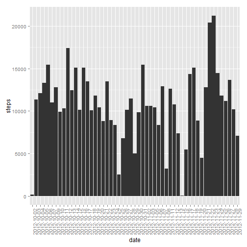
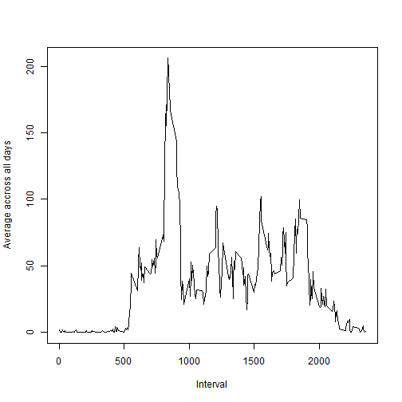
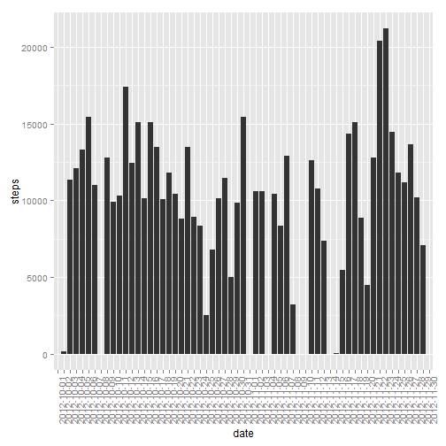

Reproducible Research
===================================================
Peer Assessment 1

Corneliu Dicusar

1) Loading and preprocessing the data


```r
setwd("E:/R/Reproductible research/Project 1/repdata_data_activity")
mydata <- read.csv("activity.csv", header = TRUE, sep=",", stringsAsFactors = FALSE)

summary(mydata)
```

```
##      steps           date              interval   
##  Min.   :  0.0   Length:17568       Min.   :   0  
##  1st Qu.:  0.0   Class :character   1st Qu.: 589  
##  Median :  0.0   Mode  :character   Median :1178  
##  Mean   : 37.4                      Mean   :1178  
##  3rd Qu.: 12.0                      3rd Qu.:1766  
##  Max.   :806.0                      Max.   :2355  
##  NA's   :2304
```

2) What is mean total number of steps taken per day?


```r
library(ggplot2)

aggregatestep <- aggregate(. ~ date, data=mydata, FUN=sum)

qplot(x=date, y = steps, data=aggregatestep, geom = "histogram") + theme(axis.text.x=theme_text(angle=90, hjust=1))
```

 

The mean of all steps taken per day is equal to: 

```r
mean(aggregatestep$steps)
```

```
## [1] 10766
```

The median of all steps taken per day is equal to: 

```r
median(aggregatestep$steps)
```

```
## [1] 10765
```

3) What is the average daily activity pattern?


```r
aggregateinterval<- aggregate(mydata$steps, list(interval = mydata$interval), mean, na.rm=TRUE)

plot(aggregateinterval$interval,aggregateinterval$x, type = "l", xlab = "Interval", ylab = "Average accross all days")
```

 

The interval with the maximum number of steps is: 


```r
aggregateinterval[which.max(aggregateinterval$x),"interval"]
```

```
## [1] 835
```
4) Imputing missing values

The total number of rows with NAs in the is:


```r
ok <- complete.cases(mydata)
sum(!ok)
```

```
## [1] 2304
```

We will replace all the NAs in the Steps column with the average for that day (calculated in a separate datable). For the days that don't have any steps recorded the NAs will be replaced with 0

The code:

```r
        aggregatestep <- aggregate(. ~ date, data=mydata, FUN=mean)
        
        noNA<-mydata

        for (i in 1: nrow(noNA)){
                if(is.na(noNA[i,"steps"]))  
                {
                        if(is.na(match(noNA[i,"date"],aggregatestep$date)))
                                {noNA[i,"steps"]<- 0}
                        else{
                                noNA[i,"steps"]<-  aggregatestep[match(noNA[i,"date"],aggregatestep$date),"steps"]
                         }
                }                       

        }
summary(noNA)
```

```
##      steps           date              interval   
##  Min.   :  0.0   Length:17568       Min.   :   0  
##  1st Qu.:  0.0   Class :character   1st Qu.: 589  
##  Median :  0.0   Mode  :character   Median :1178  
##  Mean   : 32.5                      Mean   :1178  
##  3rd Qu.:  0.0                      3rd Qu.:1766  
##  Max.   :806.0                      Max.   :2355
```

The plot for this new dataset is:


```r
aggregatestep2 <- aggregate(. ~ date, data=noNA, FUN=sum)

qplot(x=date, y = steps, data=aggregatestep2, geom = "histogram") + theme(axis.text.x=theme_text(angle=90, hjust=1))
```

 

The new mean of all steps taken per day is equal to: 

```r
mean(aggregatestep2$steps)
```

```
## [1] 9354
```

The new median of all steps taken per day is equal to: 

```r
median(aggregatestep2$steps)
```

```
## [1] 10395
```
It can be seen that the mean and the median are different now, and also there are more points in the histogram.
